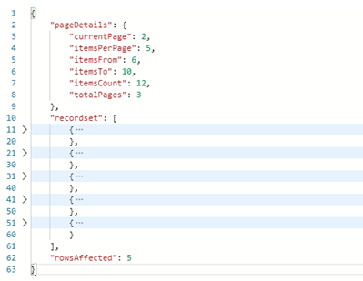

# PAGINATOR

Lib para manipulação de dados. Contém:

## Paginador

-   Utiliza verbo GET

-   Parâmetros de chamadas

    -   **page**: valor numérico inteiro. Indica a página atual a ser enviada

    -   **items\_per\_page**: valor numérico inteiro. Indica a quantidade de linhas a serem enviadas

-   Formato de saída

> 

-   Exemplo de chamada

```
    -   https://servidor/rota?page=2&items_per_page=5

    -   https://servidor/rota?page=1
```

-   Observações: **page** é obrigatório nas rotas paginadas; **items\_per\_page** se não informado recebe valor default 10

## Ordenador

-   Utiliza verbo GET

-   Parâmetros de chamadas

    -   **sort\_fields**: especifica um ou mais campos a serem ordenados, separados por vírgula. As chaves seguem o formato *campo:ASC* ou *campo:DESC* indicando a classificação do campo, crescente ou decrescente respectivamente. Se a classificação não for informada, o valor default é *ASC*. Pode trabalhar com campos aninhados para ordenação, por ex: *campo1.campo2:DESC* seguindo a estrutura hierárquica do objeto. Se mais de uma chave, a prioridade de ordenação por chave é da esquerda para a direita

    -   **sort\_case\_insensitive**: true ou false. Especifica se a ordenação será "Case Insensitive". Se falso diferencia maiúsculas de minúsculas. Se **sort\_case\_insensitive** não informado, valor default é false

-   Exemplo de chamada

```
    -   https://servidor/rota?sort_fields=tipo.id:DESC,nome:ASC&sort_case_insensitive

    -   https://servidor/rota?sort_fields=tipo.id:DESC,nome:ASC&sort_case_insensitive=true

    -   https://servidor/rota?sort_fields=nome
```

-   Observações 1: **sort\_fields** é obrigatório nas rotas ordenadas; **sort\_case\_insensitive** se não informado recebe valor default false; no exemplo acima com duas chaves de ordenação, a massa de dados é primeiramente ordenada por *tipo* e então por *nome*; **sort\_fields** pode receber também como indicador de valor true as opções yes / y / sim / s

-   Observações 2: o padrão é utilizar sempre camelCase exato (case sensitive) para identificar os campos nas chaves em **sort\_fields**. Verificar com o back-end essa regra para cada rota

## Conversor de dados JSON

-   Ação exclusiva de back-end (transparente para o front-end)

-   Nomes nos objetos de **SNAKE\_CASE** para **camelCase**

-   Nomes tabulados nos objetos para nomes aninhados nos objetos. Ex: { 'a.b.c': 1 } para { a: { b: { c: 1 } } }
